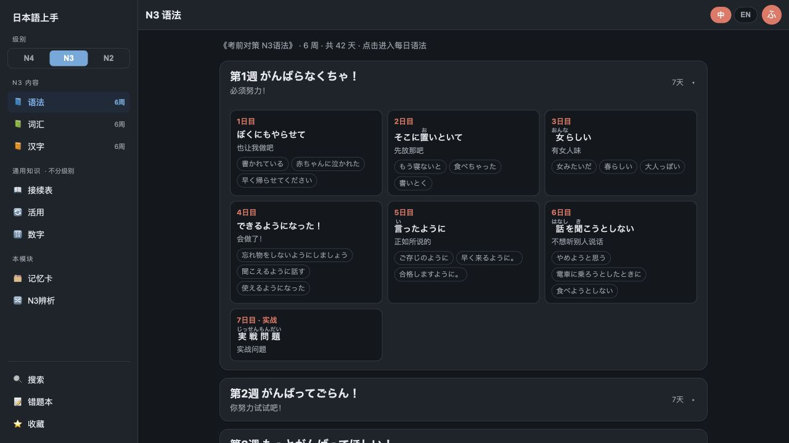

# 日本語上手 · 日语学习助手

[中文](#中文) · [English](#english)

## 中文

基于 React Router 7 和 Cloudflare Workers 的日语学习应用，覆盖 N4、N3、N2 的语法、词汇与汉字，以及 N3 读解、听解。



## 功能

- N4 / N3 / N2 的语法、词汇、汉字课程，按周与每日内容组织
- N3 读解 6 周、听解 5 章，与语法/汉字同一套目录、搜索和收藏
- 全站搜索、语法辨析、接续表、活用表与数字表达参考
- 假名注音、日语 TTS 朗读、中文 / 英文切换与深色模式
- 收藏、生词本、错题本与记忆卡
- 手机底部导航与桌面侧栏的响应式布局
- 通过 Cloudflare KV 同步收藏和错题数据；KV 不可用时自动回退到浏览器 `localStorage`

## 技术架构

- 前端：React 19、React Router 7、TypeScript、Vite
- 服务端：Cloudflare Worker（React Router SSR）
- 数据：课程内容作为带内容哈希的静态 JSON 资源缓存；收藏与错题使用 Cloudflare KV

学习区是一套 React 应用：语法、词汇、汉字、读解、听解共用同一壳、同一套周/日路由和收藏错题。课程 JSON 仍可由相邻旧项目同步。

## 本地开发

```bash
npm ci
npm run dev
```

打开 [http://localhost:5173/study](http://localhost:5173/study)。`npm run test:e2e` 用本机 Chrome 跑无头测试。

## 课程资源同步

课程 JSON 与静态资源存放在 `public/`，已随仓库提交。若本机同时存在相邻的旧项目 `../日语学习`，可使用以下命令重新同步语法/词汇/汉字课表：

```bash
npm run sync:study-assets
```

`npm run dev` 与 `npm run build` 会自动执行这一步。

## API

| Endpoint | Methods | 用途 |
| --- | --- | --- |
| `/api/favorites` | `GET`、`PUT`、`POST` | 读取和保存收藏数据 |
| `/api/mistakes` | `GET`、`PUT`、`POST` | 读取和保存错题本数据 |

接口限制请求体最大为 500 KB，并返回 JSON。当前数据模型保持原项目的单用户行为；如需公开给多位用户使用，应在部署前加入认证与按用户隔离的存储键。

## 构建与部署

```bash
npm run cf-typegen
npm run build
npm run deploy
```

部署前，请在 Cloudflare 中确认 `FAVORITES_KV` 与 `MISTAKES_KV` 已绑定到对应的 KV 命名空间。开发环境默认使用本地 KV 模拟存储。

## English

**Nihongo Jozu** is a Japanese-learning application built with React Router 7 and Cloudflare Workers. It includes N4, N3, and N2 grammar, vocabulary, and kanji, plus N3 reading and listening.

### Features

- N4 / N3 / N2 grammar, vocabulary, and kanji courses organized by week and day
- N3 reading (6 weeks) and listening (5 chapters) in the same study shell
- Global search, grammar comparisons, conjugation and connection references, and number-expression references
- Furigana, Japanese text-to-speech, Chinese / English switching, and dark mode
- Favorites, vocabulary notebook, mistake notebook, and flashcards
- Responsive mobile bottom navigation and desktop sidebar
- Favorites and mistakes sync through Cloudflare KV, with automatic browser `localStorage` fallback

### Architecture

- Frontend: React 19, React Router 7, TypeScript, and Vite
- Backend: Cloudflare Worker with React Router SSR
- Data: content-hashed static JSON for course material, plus Cloudflare KV for favorites and mistakes

The study area is a single React app. Grammar, vocabulary, kanji, reading, and listening share one shell, week/day routing, search, and favorites. Course JSON can still be synced from the adjacent legacy project.

### Local development

```bash
npm ci
npm run dev
```

Open [http://localhost:5173/study](http://localhost:5173/study). Run `npm run test:e2e` for headless Chrome tests.

### Sync course assets

Course JSON and static assets are committed under `public/`. If the adjacent legacy project exists at `../日语学习`, sync grammar/vocab/kanji tables with:

```bash
npm run sync:study-assets
```

The command also runs automatically before `npm run dev` and `npm run build`.

### API

| Endpoint | Methods | Purpose |
| --- | --- | --- |
| `/api/favorites` | `GET`, `PUT`, `POST` | Read and save favorites |
| `/api/mistakes` | `GET`, `PUT`, `POST` | Read and save mistake-notebook entries |

Requests are limited to 500 KB and return JSON. The current data model intentionally retains the legacy single-user behavior. Add authentication and per-user storage keys before making the application publicly available to multiple users.

### Build and deploy

```bash
npm run cf-typegen
npm run build
npm run deploy
```

Before deployment, make sure `FAVORITES_KV` and `MISTAKES_KV` are bound to the appropriate Cloudflare KV namespace. Local development uses KV simulation by default.
