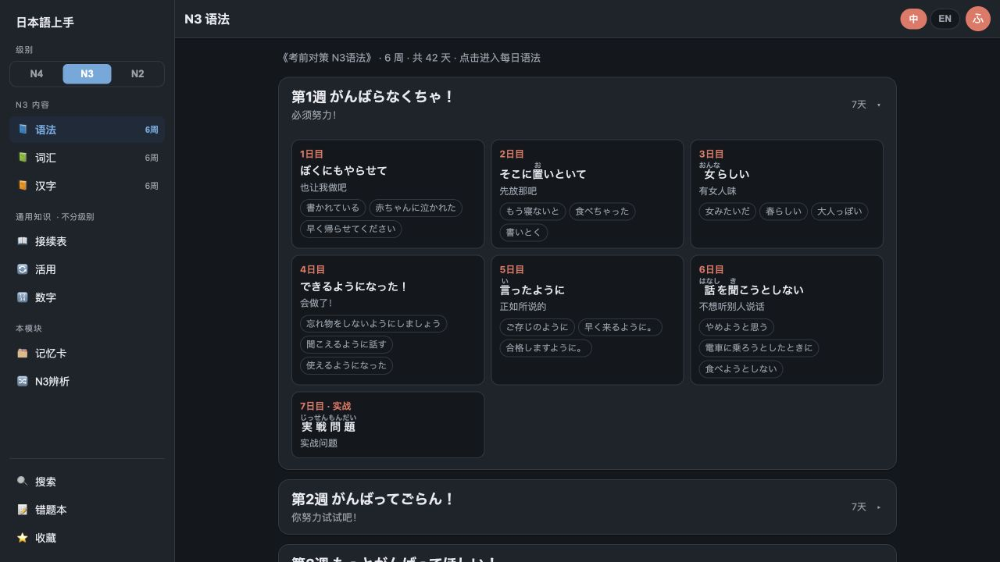

# 日本語上手 · 日语学习助手

[中文](#中文) · [English](#english)

## 中文

基于 React Router 7 和 Cloudflare Workers 的日语学习应用，覆盖 N4、N3、N2 的语法、词汇与汉字，以及 N3 / N2 读解、听解。



## 功能

- N4 / N3 / N2 的语法、词汇、汉字课程，按周与每日内容组织
- N3 / N2 读解与听解，与语法/汉字同一套目录、搜索和收藏
- 全站搜索、语法辨析、接续表、活用表与数字表达参考
- 假名注音、日语 TTS 朗读、中文 / 英文切换与深色模式
- 收藏、生词本、错题本与记忆卡
- 专题词汇（`/study/topics`）：按领域背单词，单词表 + 闪卡自测，「会了 / 不会」按间隔复习，到期的词在专题内「今天要复习」筛选里；数据和导入方法见 [`public/data/topics/README.md`](public/data/topics/README.md)
- 手机底部导航与桌面侧栏的响应式布局
- 可选 Google 登录：收藏和错题按账号写入 Cloudflare KV，未登录时只保存在本机 `localStorage`
- 可安装为 PWA；访问过的课程与播放过的音频可离线复习，重新联网后自动补交收藏和错题变化

## 技术架构

- 前端：React 19、React Router 7、TypeScript、Vite
- 服务端：Cloudflare Worker（React Router SSR）
- 数据：课程内容作为带内容哈希的静态 JSON 资源缓存；收藏与错题使用 Cloudflare KV

学习区是一套 React 应用：语法、词汇、汉字、读解、听解共用同一壳、同一套周/日路由和收藏错题。课程 JSON 提交在 `public/data/`。

## 本地开发

```bash
npm ci
npm run dev
```

打开 [http://localhost:5173/study](http://localhost:5173/study)。`npm run test:e2e` 用本机 Chrome 跑无头测试。

## Google 登录

不配置也能用，只是没有跨设备同步。要启用账号：

1. 在 Google Cloud Console 创建 Web 应用 OAuth 客户端，回调地址登记 `http://localhost:5173/auth/google/callback` 以及线上源的 `/auth/google/callback`。
2. 本地复制 `.dev.vars.example` 为 `.dev.vars`，填入 `GOOGLE_CLIENT_ID`、`GOOGLE_CLIENT_SECRET`、`SESSION_SECRET`（`openssl rand -hex 32`）。
3. 线上分别执行 `npx wrangler secret put GOOGLE_CLIENT_ID`、`GOOGLE_CLIENT_SECRET`、`SESSION_SECRET`。

学习区右上角会出现 Google 登录。未登录仍可学习；登录后收藏和错题按账号隔离，首次登录会把本机已有数据合并进空账号。

## 课程数据

课程 JSON 与静态资源存放在 `public/`，已随仓库提交。语法英文、每日讲解等生成脚本只读写本仓库的 `public/data/`。普通开发和生产构建不会改写已提交的课程数据。

## 离线使用

把网站添加到手机桌面后会直接打开 `/study`。应用缓存已经访问过的学习页面、课程数据和最近播放过的音频（最多 24 条），不会缓存登录、收藏或错题 API 响应，也不会预先下载整套音频。离线时的新收藏和错题先保存在本机，网络恢复后自动重试同步。

## API

| Endpoint | Methods | 用途 |
| --- | --- | --- |
| `/api/me` | `GET` | 当前登录用户；未登录返回 `{ user: null }` |
| `/api/favorites` | `GET`、`PUT`、`POST` | 当前账号的收藏；未登录 401 |
| `/api/mistakes` | `GET`、`PUT`、`POST` | 当前账号的错题本；未登录 401 |
| `/auth/google` | `GET` | 开始 Google 登录 |
| `/auth/google/callback` | `GET` | OAuth 回调 |
| `/auth/logout` | `GET`、`POST` | 退出登录 |

接口限制请求体最大为 500 KB，并返回 JSON。收藏与错题按用户写入 KV；游客只使用浏览器本地存储。


## 错题本手动笔记翻译（助手 CLI）

自己在错题本里手打的单词 / 语法（`type=word|grammar`）**不会**调用 Gemini 或 Workers AI。背诵页显示「翻译中…」，由助手写好译文后写入 KV。

本项目不调用任何模型（Gemini API 和 Cloudflare Workers AI 额度只给 news-learning 阅读项目用）。`/api/mistake-translations` 和 `/api/mistake-study` 只读 KV 缓存；题目译文来自课本数据。

线上 Worker 可配置 webhook（可选）：用户新加手动笔记时 POST 通知，方便触发一次助手翻译。未配置则跳过，不影响保存。

```bash
# 生产密钥（只设一次）
npx wrangler secret put MISTAKE_NOTIFY_WEBHOOK_URL
npx wrangler secret put MISTAKE_NOTIFY_WEBHOOK_KEY
```

Webhook 请求体（JSON）：

```json
{
  "event": "mistake.manual_added",
  "userId": "g_…",
  "notes": [{ "id": "…", "text": "勿体ない", "type": "word" }]
}
```

请求头：`Authorization: Bearer <MISTAKE_NOTIFY_WEBHOOK_KEY>`（若设置了 key）、`Content-Type: application/json`。

日常翻译流程（在仓库根目录，需已登录 wrangler / `CLOUDFLARE_API_TOKEN`）：

```bash
# 1) 列出尚未由助手确认的手动笔记（含临时译文 current，若有）
npm run mistakes:pending -- --user g_102093748195310724746 --out /tmp/mistake-pending.json

# 2) 助手填写译文，写成 JSON 数组，例如：
# [
#   {
#     "id": "…",
#     "text": "勿体ない",
#     "type": "word",
#     "reading": "もったいない",
#     "cn": "浪费可惜；不舍得",
#     "example": "食べ物を残すのは勿体ない。",
#     "exampleCn": "把食物剩下太可惜了。"
#   }
# ]

# 3) 写回 KV（mistake-cn + mistake-study，source=assistant，优先生效且不会被模型覆盖）
npm run mistakes:write -- --file /tmp/mistake-translations.json
```

单词建议带 `reading`（平假名）、`cn`、短例句 `example` + `exampleCn`；语法带 `cn`（意思/用法）和例句即可。

## 构建与部署

```bash
npm run cf-typegen
npm run build
npm run deploy
```

部署前，请在 Cloudflare 中确认 `FAVORITES_KV` 与 `MISTAKES_KV` 已绑定到对应的 KV 命名空间。开发环境默认使用本地 KV 模拟存储。

## English

**Nihongo Jozu** is a Japanese-learning application built with React Router 7 and Cloudflare Workers. It includes N4, N3, and N2 grammar, vocabulary, and kanji, plus N3 / N2 reading and listening.

### Features

- N4 / N3 / N2 grammar, vocabulary, and kanji courses organized by week and day
- N3 / N2 reading and listening in the same study shell
- Global search, grammar comparisons, conjugation and connection references, and number-expression references
- Furigana, Japanese text-to-speech, Chinese / English switching, and dark mode
- Favorites, vocabulary notebook, mistake notebook, and flashcards
- Responsive mobile bottom navigation and desktop sidebar
- Optional Google sign-in: favorites and mistakes sync per account through Cloudflare KV; guests stay on `localStorage`
- Installable PWA support: visited lessons and played audio remain available offline, and pending notebook changes retry after reconnection

### Architecture

- Frontend: React 19, React Router 7, TypeScript, and Vite
- Backend: Cloudflare Worker with React Router SSR
- Data: content-hashed static JSON for course material, plus Cloudflare KV for favorites and mistakes

The study area is a single React app. Grammar, vocabulary, kanji, reading, and listening share one shell, week/day routing, search, and favorites. Course JSON lives in `public/data/`.

### Local development

```bash
npm ci
npm run dev
```

Open [http://localhost:5173/study](http://localhost:5173/study). Run `npm run test:e2e` for headless Chrome tests.

### Google sign-in

The app works without credentials; only cross-device sync is missing. To enable accounts:

1. Create a Web application OAuth client in Google Cloud Console. Register `http://localhost:5173/auth/google/callback` and your production `/auth/google/callback`.
2. Copy `.dev.vars.example` to `.dev.vars` and set `GOOGLE_CLIENT_ID`, `GOOGLE_CLIENT_SECRET`, and `SESSION_SECRET` (`openssl rand -hex 32`).
3. In production, `npx wrangler secret put` the same three names.

A Google button appears in the study top bar. Study stays open to guests. After sign-in, favorites and notes are stored under that user; the first login merges any existing local data into an empty account.

### Course data

Course JSON and static assets are committed under `public/`. Generators for English glosses and daily explanations read and write only this repository's `public/data/`. Normal development and production builds never rewrite committed course data.

### Offline use

An installed PWA opens directly at `/study`. It caches visited learning pages, their course data, and up to 24 recently played audio tracks. Authentication and notebook API responses are never cached, and the app does not download the entire audio library up front. Favorites and mistakes created offline stay local first and retry automatically when the connection returns.

The service-worker cache version is generated at build time; never edit it by hand. `public/sw.js` holds the placeholder `__SW_CACHE_VERSION__`, and the Vite plugin in `sw-cache-version.ts` writes `<UTC build time>-<short commit>` (for example `20261004T071205Z-abcdef1`) into `build/client/sw.js`. The commit comes from `WORKERS_CI_COMMIT_SHA` on Cloudflare Workers Builds, `GITHUB_SHA` on GitHub Actions, or `git rev-parse HEAD` locally. Every deploy therefore ships a new worker that clears the old caches and reloads open clients, and parallel pull requests never conflict on the version.

### API

| Endpoint | Methods | Purpose |
| --- | --- | --- |
| `/api/me` | `GET` | Current user; guests get `{ user: null }` |
| `/api/favorites` | `GET`, `PUT`, `POST` | Per-account favorites; 401 when signed out |
| `/api/mistakes` | `GET`, `PUT`, `POST` | Per-account mistakes; 401 when signed out |
| `/auth/google` | `GET` | Start Google sign-in |
| `/auth/google/callback` | `GET` | OAuth callback |
| `/auth/logout` | `GET`, `POST` | Sign out |

Requests are limited to 500 KB and return JSON. Favorites and mistakes are namespaced by user in KV. Guests stay on browser storage.

### Build and deploy

```bash
npm run cf-typegen
npm run build
npm run deploy
```

Before deployment, make sure `FAVORITES_KV` and `MISTAKES_KV` are bound to the appropriate Cloudflare KV namespace. Local development uses KV simulation by default.
